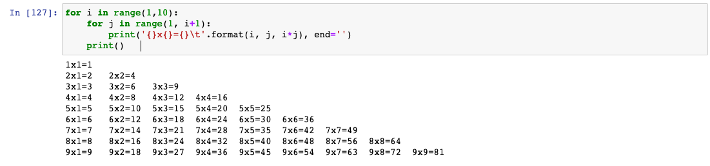

# Python学习
### 第一章 基础语法练习

#### python环境准备

##### 1、安装pyenv并创建虚拟环境

```shell
#安装pyenv python环境
brew update
brew install pyenv
#安装python环境，根据自己需要安装对应版本
pyenv install 3.6.9 -vvv
#安装 virtualenv 虚拟环境
brew install pyenv-virtualenv
#利用pyenv的虚拟环境，创建python虚拟环境
pyenv virtualenv 3.6.9 py369
#设定项目pyenv虚拟环境
pyenv local py369
```


1. 乘法口诀表

   

   

